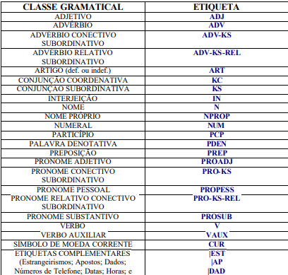

# POS_Tagging_NLP

### O TRABALHO
Nosso objetivo é estudar a tarefa de POS Tagging para a língua Portuguesa. Para isso utilizaremos o corpus Mac-Morpho, produzido pelo grupo NILC da ICMC USP. O Mac-Morpho oferece dados para treinamento, validação e teste de modelos preditivos, capazes de classificar a classe gramatical de palavras em Português. Para acessar o conjunto de classes, acesse http://nilc.icmc.usp.br/macmorpho/macmorpho-manual.pdf.

### POS TAGGING

POS Tagging: Na linguística de corpus, marcação de parte da fala (POS Tagging), também chamado marcação gramatical é o processo de marcar uma palavra em um texto (corpus) como correspondente a um determinado parte do discurso, baseado tanto na sua definição como na sua contexto. Uma forma simplificada disso é comumente ensinada a crianças em idade escolar, na identificação de palavras como substantivos, verbos, adjetivos, advérbios, etc. (Wikipedia)

### O CORPUS
Mac-Morpho é um corpus de textos em Português do Brasil anotados com tags de parte da fala. Sua primeira versão foi lançada em 2003, e desde então, duas revisões foram feitas a fim de melhorar a qualidade do recurso. O corpus possui milhões de palavras retiradas do jornal Folha de São Paulo (1994) Dito isso, o pacote Natural Language Toolkit (NLTK), possui um módulo com o corpus MacMorpho para download e tratamento  
 
### AS TAGS

### OS MODELOS
Aqui, estamos treinando dois modelos de tagger (Unigram e Bigram), cuja definição será apresentada abaixo:

- Como o nome indica, o **Unigram Tagger** é um tagger que usa apenas uma única palavra como seu contexto para determinar a tag POS(Part-of-Speech). Em palavras simples, Unigram Tagger é um tagger baseado em contexto cujo contexto é uma única palavra, ou seja, Unigram.

- Um n-gram é uma subsequência de n itens, portanto, como o nome indica, **Bigram Tagger** subclasse olha para os dois itens. O primeiro item é a palavra com tag anterior e o segundo item é a palavra com tag atual.